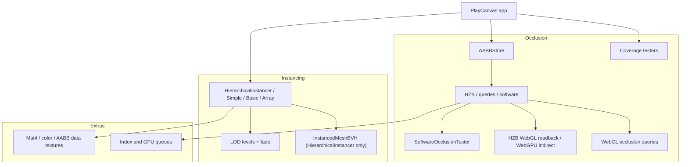
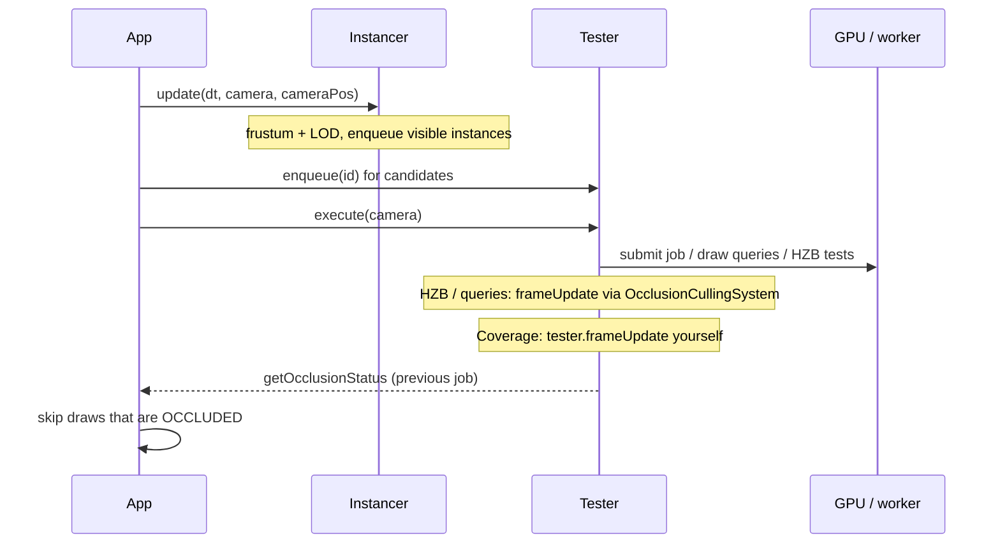

# Architecture

The library is three public systems plus a shared extras layer. You can use instancing without occlusion, and occlusion without instancing.

## Shared AABB store

[`AABBStore`](extras.md) holds packed centers and half-extents, optionally as GPU textures. HZB, queries, and software testers lock IDs on that store. Coverage testers own a CPU AABB pool: `lock` / `unlock` / `enqueueAabbUpdate` on the tester.

`OcclusionCullingSystem` takes an `AABBStore` and constructs the GPU testers that match the current device (WebGL2 HZB + queries, or WebGPU HZB). Software occlusion and the coverage buffer are constructed separately: `new SoftwareOcclusionTester(aabbStore, params)`, `new WebglCoverageBuffer(device)` or `new WebgpuCoverageBuffer(device)` + `new CoverageBufferTesterWorker(coverage)`.

## Frame order

A typical frame that uses both instancing and a readback occlusion tester:

Submit work early, consume results from the last **finished** job. Do not wait for the GPU or worker on the same frame unless you accept a stall.

`frameUpdate` is not universal: software has none; coverage, WebGL HZB, and queries harvest in `frameUpdate`. `OcclusionCullingSystem` runs HZB and queries on `frameupdate`, but **not** coverage — call `tester.frameUpdate(dt)` yourself.

A coverage tester harvests in `frameUpdate`. Call that every frame, `execute` after enqueue (often in `update`), and `updateGPUDepthBuffer` after opaque depth (`postrender`) so tests use the last finished capture.

For **WebGPU HZB**, `execute` writes `instanceCount` into an indirect draw buffer. There is no `getOcclusionStatus` on that path.

## What stays internal

These are implementation details, not a public API:

- `SoftwareOcclusionWorker` (blob worker, Hi-Z only on the worker; owns occluder/mesh state)
- `CoverageCpuBuffer` (JS reproject + AABB tests; lives only inside the coverage worker blob)
- `CoverageAABBStore` (coverage AABB pool owned by the tester)
- HZB, coverage, and query shaders

Change them in source; do not document them for application code.
