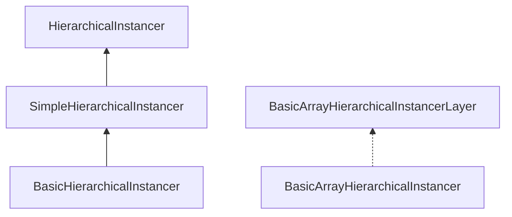

# Instancing overview

GPU instancing stores per-instance matrices (and optional colors) in square data textures. Mesh materials are patched with shader chunks so the vertex shader samples `instanceId` → matrix instead of a node transform.

LOD is a list of mesh groups with increasing distance. The instancer picks a level per instance, optionally cross-fades, and writes the visible subset into each level’s instancing list.

## Class stack

`BasicArrayHierarchicalInstancerLayer` is a **view** of one layer, not a subclass of the array instancer.

| Class | Role |
| --- | --- |
| `BasicHierarchicalInstancer` | Capacity, matrix/color textures, `addLOD`, shader patching |
| `SimpleHierarchicalInstancer` | Visibility flags, time-based LOD fade, `update()` frustum loop |
| `HierarchicalInstancer` | Same as Simple, plus `computeBVH()` for faster frustum + LOD |
| `BasicArrayHierarchicalInstancer` | Shared `sampler2DArray` textures, one layer view per logical group |

Pick a class in [Choosing an instancer](choosing-instancer.md). LOD distances and fade are in [LOD](lod.md).

## Per-frame `update`

`SimpleHierarchicalInstancer.update(dt, camera, cameraPosition)`:

1. Advances fade timers
2. Tests each active instance against the camera frustum (or the BVH, if present)
3. Chooses LOD from camera-distance²
4. Enqueues the instance into the LOD renderer’s GPU list
5. Sorts if any LOD material needs object sort

You still need those mesh instances in a PlayCanvas layer. The instancer only fills instance buffers and counts.

## Shader chunks

`addLOD` replaces material chunks for GLSL and WGSL (matrix, instance id, color, cross-fade, pick id). Do not mix these materials with a second instancing scheme on the same mesh.

`shaderChunksVersion` is set to `"2.8"` to match PlayCanvas 2.x chunk APIs.
