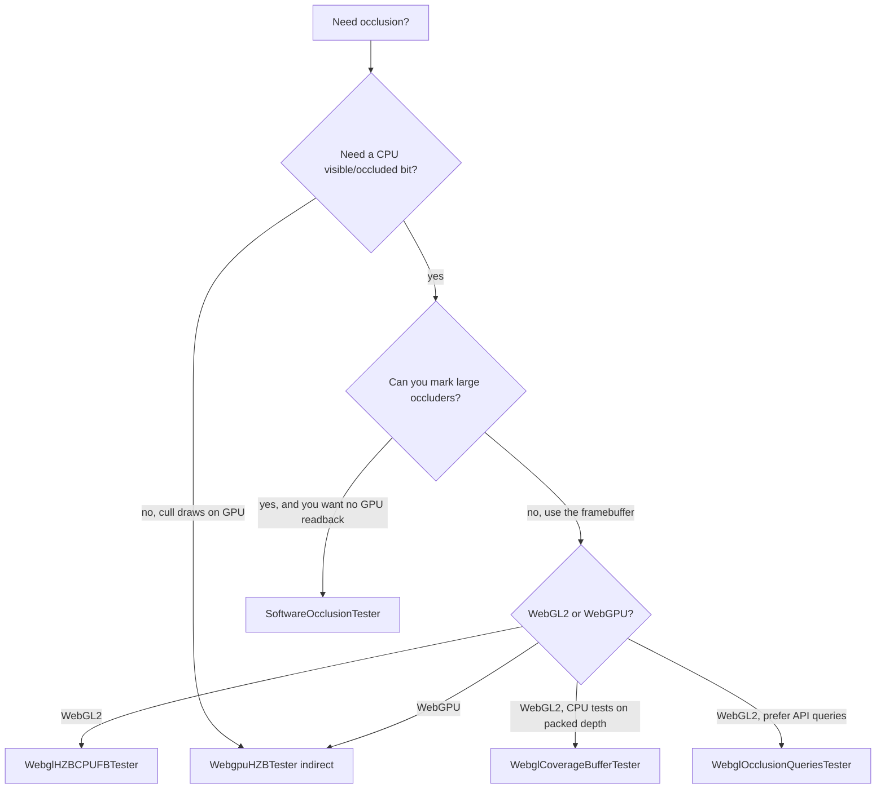

# Choosing an occlusion backend

There is no single best tester. Choose by API (CPU bit vs indirect draw), latency, and device.

| Backend | Device | How you read the result | Typical latency | Occluders |
| --- | --- | --- | --- | --- |
| [Software](software.md) | Any (CPU worker) | `getOcclusionStatus` | 1 job (often 1 frame) | Explicit: box, sphere, cone, cylinder, plane, mesh |
| [HZB WebGL](hzb.md) | WebGL2 | `getOcclusionStatus` (readback / transform feedback) | ~1+ frames | Scene depth → Hi-Z |
| [HZB WebGPU](hzb.md) | WebGPU | Indirect draw (`instanceCount`) | Same frame on GPU | Scene depth → Hi-Z |
| [Coverage](coverage.md) | WebGL2 | `getOcclusionStatus` (PBO depth → CPU tests) | ~2+ frames | Scene depth → packed 256×128 |
| [Queries](queries.md) | WebGL2 only | `getOcclusionStatus` | 1–N frames | Hardware occlusion queries on box proxies |

WebGPU does not get the queries tester or the coverage buffer (`OcclusionCullingSystem` leaves queries `null`; coverage is never constructed by the system). Use HZB there.

## Decision sketch



## When to pick software

- You can list **coarse occluders** (buildings, terrain chunks, proxy boxes)
- You want **no GPU readback** and a worker-thread Hi-Z
- You need the same path on WebGL and WebGPU
- A frame of delay is acceptable

Raster resolution defaults to 256×128. That is conservative and cheap; it is not a shadow map.

## When to pick HZB

- Occluders are whatever already wrote depth (the real scene)
- WebGL: you can live with GPU readback delay (the tester pipelines transform-feedback results across frames)
- WebGPU: you can issue **indirect draws** and do not need a CPU bit

HZB quality depends on the depth buffer you feed it. Transparent and first-person near geometry need extra care (see [HZB](hzb.md)).

## When to pick coverage

- WebGL2, and you want a CPU `getOcclusionStatus` from **scene depth** without transform-feedback tests or query draws
- Occluders are large solids already in the framebuffer (buildings, terrain)
- A couple of frames of delay and a 256×128 packed buffer are acceptable
- You would rather not maintain an explicit software occluder set

Coverage downloads a small packed depth (async PBO) and tests AABBs on the CPU. It is coarser than GPU HZB and always one capture behind the camera. Call `updateHZB` after opaque depth and `execute` to poll/test — they are not the same call. See [coverage buffer](coverage.md).

## When to pick queries

- WebGL2 only
- You want hardware `ANY_SAMPLES_PASSED` (or conservative vs accurate modes)
- Object counts stay modest; each query has GPU overhead
- You can wait one or more frames for `resultAvailable`

`OCCLUSION_ALGORITHM_TYPE_CONSERVATIVE` vs `ACCURATE` trades false visibility for tighter tests ([queries](queries.md)).

## Combining with instancing

Use software, WebGL HZB, coverage, or queries to **skip CPU enqueue** into an instancer. Use WebGPU HZB to **zero indirect instance counts** without reading back.

Do not run two readback testers on the same objects every frame unless you are comparing them. Pick one production path.

## `UNKNOWN` policy

For every CPU-status backend:

```ts
if (tester.getOcclusionStatus(id) !== OCCLUSION_OCCLUDED) {
    draw();
}
```

Never hide on `UNKNOWN`. That is the conservative default and avoids pop-in on the first frames and when a job is dropped.
