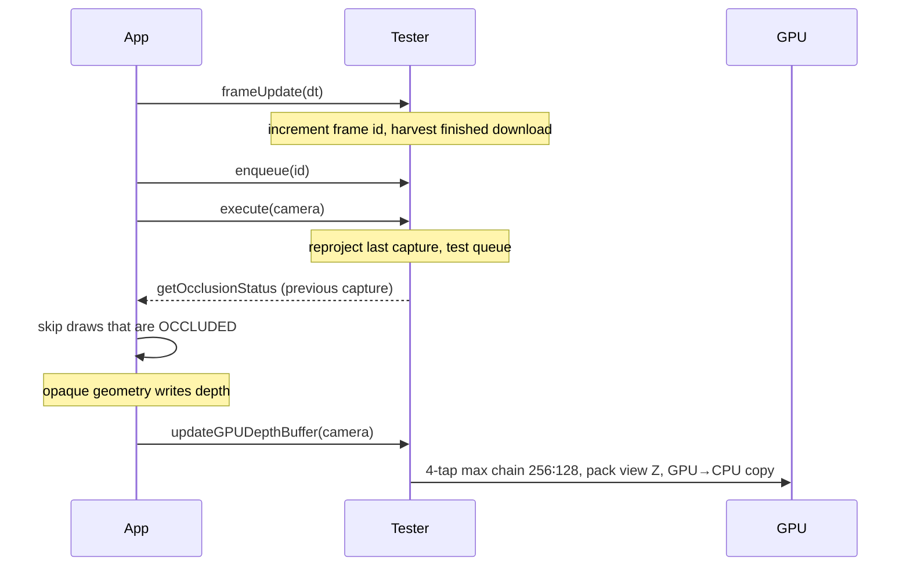
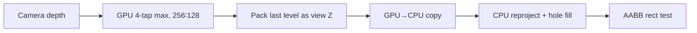

# Coverage buffer

`WebglCoverageBuffer` / `WebgpuCoverageBuffer` downsample the camera depth map with a 4-tap **max** chain that keeps **256×128** aspect at every level. GPU chain levels stay in **device Z**. The last level is packed as **view-space Z in metres** and copied to the CPU. `CoverageBufferTester` reprojects that capture and tests queued AABBs **on the CPU**.

Both buffers implement `ICoverageBuffer` (package type export). That interface extends `IHierarchicalZBuffer` for the GPU chain textures and sizes, and adds packed CPU fields plus `update` / `frameUpdate` / `resize`.

The tester is a GPU→CPU readback tester (`IGPU2CPUReadbackOcclusionCullingTester`). It is **not** an HZB tester: there is no `hzb` property, and `OcclusionCullingSystem` does not construct this path. The downsample call is `updateGPUDepthBuffer`, not `updateHZB`. Harvest is `tester.frameUpdate(dt)` (forwards to `coverage.frameUpdate`); `execute` only reprojects and tests.

| Device | Pack | Download |
| --- | --- | --- |
| WebGL2 | Transform feedback (`out_depth`) | `copyBufferSubData` → STREAM_READ PBO + `fenceSync` |
| WebGPU | Compute write to a storage buffer | `StorageBuffer.read` (copy to a fresh MAP_READ staging, then `mapAsync`) |

Packed `cpuDepth` is always in GL / NDC order (row 0 = NDC y = −1). WebGPU inverts Y in the pack pass so the CPU buffer matches WebGL.

## Setup

```ts
import {
    AABBStore,
    WebglCoverageBuffer,
    WebgpuCoverageBuffer,
    CoverageBufferTester,
    OCCLUSION_OCCLUDED,
} from "playcanvas-opti-pixel";

const aabbs = new AABBStore(app.graphicsDevice, 4096);
const coverage = app.graphicsDevice.isWebGPU
    ? new WebgpuCoverageBuffer(app.graphicsDevice)  // 256×128
    : new WebglCoverageBuffer(app.graphicsDevice);  // WebGL2, 256×128
const tester = new CoverageBufferTester(coverage, aabbs);

camera.requestSceneDepthMap(true); // CameraComponent — creates renderPassDepthGrab

const id = tester.lock(worldAabb);

app.on("frameupdate", (dt) => {
    tester.frameUpdate(dt);
});

app.on("update", () => {
    tester.enqueue(id);
    tester.execute(camera.camera);
    if (tester.getOcclusionStatus(id) !== OCCLUSION_OCCLUDED) {
        // draw — treat UNKNOWN as visible
    }
});

// After the depth grab has the current opaque depth
app.on("postrender", () => {
    tester.updateGPUDepthBuffer(camera.camera);
});
```

In the snippets, `camera` is a PlayCanvas `CameraComponent` (`camera.camera` is `pc.Camera`).

You can call `tester.frameUpdate(dt)` at the start of `update` instead of on `frameupdate`. Do not harvest from `postrender` / `coverage.update` — that races the GPU copy.

The downsample reads **depth grab** (`pc.Camera.renderPassDepthGrab`). Without `requestSceneDepthMap(true)`, `updateGPUDepthBuffer` is a no-op. CameraFrame’s `rendering.sceneDepthMap` prepass is a different texture and is not sampled here.

`enqueue` returns `-1` (`SOME_ENQUEUE_PROBLEM`) when the per-frame queue is already at AABB-store capacity.

The next `updateGPUDepthBuffer` rebuilds GPU targets if the camera depth texture size changed, and sets `cpuReady` back to false. Use `coverage.resizeWithDelay()` if you want `execute` to fill `UNKNOWN` while a canvas resize is debounced. `execute` grows result arrays if the AABB store grew; `tester.resize()` does the same and also resets the applied CPU version.

Call `coverage.destroy()` and `tester.destroy()` when done. `tester.destroy()` only clears the queue; it does not destroy the coverage buffer.

## Frame contract

`frameUpdate`, `execute`, and `updateGPUDepthBuffer` are separate. `execute` never harvests and never builds the downsample chain.



| Call | When | What it does |
| --- | --- | --- |
| `frameUpdate(dt)` | Every frame (`frameupdate`, or the start of `update`) | Increments `coverage`’s frame id and harvests **one** finished download. `minReadbackLag` is counted in these ticks. Does **not** test AABBs. |
| `execute(camera)` | After enqueue, typically on `update` | Reprojects the last harvested capture, tests the queue, clears the queue. |
| `updateGPUDepthBuffer(camera)` | After opaque depth (`postrender`) | Builds the GPU downsample chain and submits **one** readback when a slot is free. No-op while `coverage` is disabled or `resizePending`, or if the camera has no depth grab. WebGL also skips the **whole chain** on non-capture ticks (`readbackPeriod`) and when no slot is free. WebGPU always builds the chain; pack still needs a free slot. Does **not** poll finished downloads. |

Call **all three** every frame. Skipping `frameUpdate` freezes harvest (`cpuReady` stays false, `minReadbackLag` never elapses). Skipping `updateGPUDepthBuffer` means no new capture is submitted. Skipping `execute` leaves last frame’s flags in place until the next test.

`execute` can run **earlier** in the frame than `updateGPUDepthBuffer`. Tests always use the last **finished** download, never the chain that was just submitted. A second `updateGPUDepthBuffer` before the next `frameUpdate` is ignored (`acquire` refuses another slot).

WebGL `readbackPeriod`: a pack is attempted every N `updateGPUDepthBuffer` calls that reach acquire. Harvest still polls every `frameUpdate`. A pack **before** the first `frameUpdate` is allowed (frame id is still `0`); `minReadbackLag` then counts `frameUpdate` ticks from that submit. With the default `N = 1`, every pack attempt is a capture unless a slot was already submitted since the last `frameUpdate` or no slot is free.

In a custom frame graph you can call `coverage.update(camera)` instead of `updateGPUDepthBuffer`. You still need `tester.frameUpdate` to harvest and `execute` to test. Do not call both `tester.frameUpdate` and `coverage.frameUpdate` in the same tick — the tester already forwards.

Until the first download finishes (`coverage.cpuReady`), and again while the buffer is disabled, `resizePending`, the CPU test buffer is not `valid`, or not yet re-ready after a resize, `execute` drops the queue and fills `OCCLUSION_UNKNOWN`. An empty queue does the same (every id, not only the ones you skipped). Do not keep a stale `OCCLUDED`. When the queue is non-empty, only queued ids get new flags; unqueued ids keep the previous status — enqueue every occludee you care about each frame.

Results lag **at least one GPU frame** (typically two).

## Pipeline



1. `updateGPUDepthBuffer` (or `coverage.update`) downsamples with a **max** of four taps at ±0.5 source texels. Stage count is `min(maxDownsampleStages, max(1+log2(src/cap)))`, at least 1; each dest size is `cap << (stages−i−1)` so every level keeps 256∶128 (`256<<n` × `128<<n` down to the CPU cap). Quad textures are the first `stages−1` levels; the last stage is the pack. If `stages === 1`, pack samples the camera depth directly. NDC −1..1 maps to the full target (the screen is stretched into 2∶1).
2. The last stage writes `width×height` **view-space Z** (metres). Device Z is max-downsampled on GPU, then linearized at pack: perspective `near*far / (far + z*(near-far))`, ortho `near + z*(far-near)` (`camera_params` = `(1/far, far, near, ortho)`). WebGL: transform feedback; WebGPU: compute storage buffer (Y inverted to GL order). Default **4** in-flight slots, **2** frames of minimum lag (`minReadbackLag`).
3. `frameUpdate` polls finished slots. WebGL harvests **FIFO**, one eligible slot per tick, and never skips a fenced capture. WebGPU harvests the **newest** ready slot and ignores older in-flight downloads (PlayCanvas `StorageBuffer.read`: copy to a fresh MAP_READ staging, then `mapAsync`).
4. `execute` reprojects that capture into the test camera. If the capture view-projection matches, the CPU copies the buffer (no scatter). Otherwise it reprojects in **view-space Z**: scatter keeps the **closer** sample (`min` metres). Perspective cameras use a cheaper path (one divide per pixel). Empty pixels take the **farthest** real neighbor in 3×3 (remaining holes stay at far).
5. Each queued AABB is projected for a screen rect; the test depth is the AABB’s nearest **view-space Z** from the view matrix (center ± extents along camera forward), clamped to near. Occluded iff every pixel in the rectangle has view Z ≤ that nearest Z. `rectPadPixels` defaults to **0**. There is **no** world expand by default (`aabbExpand = 0`).

There is no CPU Hi-Z. A large screen-space AABB walks pixels on the 256×128 grid.

## Readback knobs

| Property | Default | Meaning |
| --- | --- | --- |
| `maxWidth` / `maxHeight` | `256` / `128` | CPU target size |
| `maxDownsampleStages` | `4` | Cap on downsample + pack stages. Setter rebuilds the chain. |
| `cpuReadback` | `true` (forced on by the tester) | Submit pack + download when a slot is acquired |
| `readbackSlots` | `4` | In-flight pack/download slots. WebGL clamps this to at least **2**. |
| `minReadbackLag` | `2` | `frameUpdate` ticks to wait before polling a slot |
| `readbackPeriod` | `1` (WebGL only) | Submit a capture every N pack attempts (`updateGPUDepthBuffer`). Harvest still polls every `frameUpdate`. The downsample chain is skipped on ticks that will not capture. On Android Chrome, `getBufferSubData` is an ordered GPU-process wait — set this to `3` (or higher) there. |
| `tester.aabbExpand` | `0` | World AABB inflate × camera-to-box distance. Leave at 0 for far culls. |
| `tester.rectPadPixels` | `0` | Extra coverage pixels around the projected rect. Raise if motion pops far objects visible. |

The download is 256×128×4 bytes (~128 KB) at the default size. Packed values are **view-space Z in metres**, not device Z.

WebGL constructor also takes `slotCount` and `minReadbackLag` (`new WebglCoverageBuffer(device, 256, 128, 4, 2)`). WebGPU takes size only; use `readbackSlots` / `minReadbackLag` after construct. WebGPU has no `readbackPeriod`: every `update` builds the chain; pack still needs a free slot. WebGL `readbackSlots = 1` becomes `2`.

On Android Chrome, `getBufferSubData` is an ordered GPU-process wait (~one frame), not a memcpy of those 128 KB. Set `coverage.readbackPeriod = 3` (or higher) so WebGL captures less often and skips the downsample chain in between. Do not call `gl.flush()` after the PBO fence. If far objects pop visible while turning, raise `tester.rectPadPixels` before lowering `readbackPeriod`.

`coverage.cpuDepth` is the last packed buffer (view-space Z, not yet reprojected). `coverage.cpuCameraParams` is `(1/far, far, near, ortho)` for that capture. `coverage.cpuVersion` bumps on resize and each harvested capture so `execute` can skip a redundant `setSource`. `tester.cpuBuffer` is the **reprojected** test buffer (`CoverageCpuBuffer`, not a package export). Replacing `tester.coverage` forces `cpuReadback = true` and resets the applied version.

## How an AABB is tested

`CoverageCpuBuffer` uses the camera position and view matrix, then clips the AABB hull to the view frustum and projects the visible edges. The screen rectangle is padded by `rectPadPixels`. The nearest test depth is view-space Z in metres (not `z/w` device Z). The object stays **visible** when:

- the camera is inside the (optionally expanded) box
- it is fully at or past the far plane (`minEyeZ >= far`)
- its farthest view Z is closer than every sample (`maxEyeZ <` buffer min)
- the clipped hull is empty (fully outside the frustum or behind the camera)
- the projected rect is off-screen
- any pixel in its **on-screen** rectangle is farther than the AABB’s nearest view Z (`zBuffer > minEyeZ`)

It is **occluded** when:

- its nearest view Z is behind every sample (`minEyeZ >` buffer max), or
- every covered pixel is closer or equal (`zBuffer <= minEyeZ`)

AABBs that **straddle** the far plane are still tested: only the clipped hull is used. Unclipped corners past far used to force `VISIBLE` and killed far culls.

If the capture view-projection matches the test camera, the CPU copies the depth (no scatter). Otherwise it reprojects as above. Scatter holes stay far (white in the debug overlay); they do not grow occluders.

## Querying the CPU buffer

After `execute`, `tester.cpuBuffer` is the reprojected map used for AABB tests (origin bottom-left, GL / packed CPU). It is not a package export; use the tester getter.

| Method | Range |
| --- | --- |
| `getMinDepthUv(u0, v0, u1?, v1?)` / `getMaxDepthUv(...)` | UV 0..1. Omit `u1`/`v1` for one texel. Half-open in texel space: `[u0,u1)`. |
| `getMinDepthPixels(x0, y0, x1?, y1?)` / `getMaxDepthPixels(...)` | Inclusive pixel rectangle. Omit `x1`/`y1` for one pixel. |

Fully off-screen queries and an unbuilt buffer return `cpuBuffer.farClip`. Depths are view-space Z in metres.

## Debug overlay

`CoverageBufferDebugger` is a package export. Bind the **tester** (not only the coverage buffer) so the strip includes the CPU-reprojected test buffer.

Draw the overlay **after** `frameUpdate` and `execute` so the packed tile is harvested and `tester.cpuBuffer` is valid.

GPU chain thumbnails are still **device Z**. Packed and reprojected tiles are view-space Z (the overlay divides by `far` only for display).

```ts
import { CoverageBufferDebugger } from "playcanvas-opti-pixel";

const debug = new CoverageBufferDebugger(app, tester);

app.on("frameupdate", (dt) => {
    tester.frameUpdate(dt);
});

app.on("postrender", () => {
    tester.updateGPUDepthBuffer(camera.camera);
});

app.on("update", () => {
    tester.execute(camera.camera);
    debug.debug();                 // chain + packed + reprojected
    debug.debugItem(id);           // wire AABB + screen rect
    // debug.debugPacked();        // fullscreen CPU target
    // debug.debugReprojected();   // fullscreen test buffer
    // debug.debugMipLevel(0);     // one GPU chain level
});
```

If you replace the coverage-buffer instance, set `debug.tester` again.

| Method | What it draws |
| --- | --- |
| `debug(count?, ...)` | Right-side strip: GPU chain, packed download, then reprojected CPU buffer. `count` `0` = every chain pass. If `stages === 1` there are no chain textures (pack samples camera depth), so the strip is packed + reprojected only. |
| `debugBuffer(i, x, y, w, h)` | One GPU chain texture |
| `debugMipLevel(level)` | One chain level, fullscreen |
| `debugPacked(x?, y?, w?, h?)` | CPU download after pack readback. UV 0..1 = NDC |
| `debugReprojected(...)` | CPU test buffer after reprojection + hole fill |
| `debugItem(id, box?, rect?, packed?, reprojected?)` | Wire AABB (green visible / red occluded) and screen rect. `reprojected` overlays the test buffer; otherwise `packed` overlays the packed download |

## Compared with the other backends

| vs | Coverage difference |
| --- | --- |
| [HZB WebGL](hzb.md) | HZB keeps a full mip chain and tests on GPU (transform feedback), then reads **flags**. Coverage downsamples with a 4-tap max chain, then a pack pass writes **view-space Z** and tests on CPU. Coarser, and never uses the depth that was just submitted this frame. |
| [HZB WebGPU](hzb.md) | WebGPU HZB culls by writing indirect `instanceCount`. Coverage still gives a CPU `getOcclusionStatus` bit from a packed 256×128 download. |
| [Queries](queries.md) | Queries rasterize box proxies with `ANY_SAMPLES_PASSED`. Coverage uses the depth you already rendered and one small readback. No per-object query draws. WebGL2 only for queries. |
| [Software](software.md) | Software rasterizes **explicit** occluders on a worker. Coverage uses **scene depth**, so you do not maintain an occluder set — but you inherit GPU latency, reprojection, and 256×128. |

## Limitations

- Always a previous capture; fast camera motion leaves far holes (false visibles), not inflated occluders. Raise `rectPadPixels` if far objects pop visible while looking around; do not turn `aabbExpand` back on for that.
- 256×128 cannot represent thin occluders; this path is for large solids (buildings, terrain). Far objects behind a wall still need the wall to cover their (padded) rect — raise `coverage.maxWidth` / `maxHeight` if mixed sky/wall texels leak through.
- Large screen-space AABBs are O(pixels in the rect) on CPU
- First frames after construct / resize / context loss: `cpuReady` is false; that `execute` fills `UNKNOWN` and drops the queue
- You must call `frameUpdate` every frame yourself; `OcclusionCullingSystem` does not harvest this path
- You must call `updateGPUDepthBuffer` yourself after opaque depth; nothing else builds the chain
- No depth grab (`requestSceneDepthMap`) means that call is a no-op and `cpuReady` stays false
