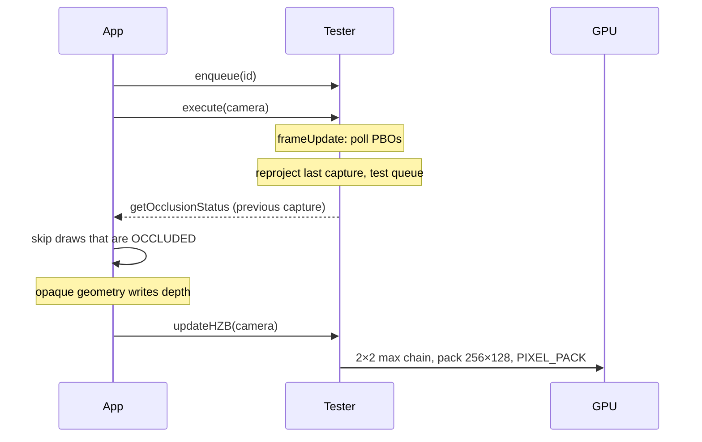
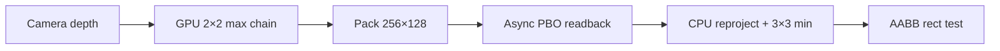

# Coverage buffer (WebGL2)

`WebglCoverageBuffer` downsamples the camera depth map into a packed **256×128** (default) RGBA8 target and downloads it with async PIXEL_PACK. `WebglCoverageBufferTester` reprojects that capture into the current camera and tests queued AABBs **on the CPU**.

This tester is a GPU→CPU readback tester (`IGPU2CPUReadbackOcclusionCullingTester`). It is **not** an HZB tester: there is no `hzb` / `frameUpdate` on it, and `OcclusionCullingSystem` does not construct this path.

WebGPU: not implemented. Use [HZB](hzb.md).

## Setup

```ts
import {
    AABBStore,
    WebglCoverageBuffer,
    WebglCoverageBufferTester,
    OCCLUSION_OCCLUDED,
} from "playcanvas-opti-pixel";

const aabbs = new AABBStore(app.graphicsDevice, 4096);
const coverage = new WebglCoverageBuffer(app.graphicsDevice); // WebGL2, 256×128
const tester = new WebglCoverageBufferTester(coverage, aabbs);

const id = tester.lock(worldAabb);

app.on("update", () => {
    tester.enqueue(id);
    tester.execute(camera.camera);
    if (tester.getOcclusionStatus(id) !== OCCLUSION_OCCLUDED) {
        // draw — treat UNKNOWN as visible
    }
});

// After opaque geometry has written depth
app.on("postrender", () => {
    tester.updateHZB(camera.camera);
});
```

`enqueue` returns `-1` (`SOME_ENQUEUE_PROBLEM`) when the per-frame queue is already at AABB-store capacity.

On canvas resize, `coverage.resize()` / `resizeWithDelay()` rebuilds GPU targets and sets `cpuReady` back to false. Call `tester.resize()` if the AABB store grew.

Call `coverage.destroy()` and `tester.destroy()` when done.

## Frame contract

`updateHZB` and `execute` are separate. `execute` never builds the downsample chain.



| Call | When | What it does |
| --- | --- | --- |
| `updateHZB(camera)` | After opaque depth (`postrender`) | Builds the GPU downsample chain and submits readback. No-op while `coverage` is disabled or `resizePending`. |
| `execute(camera)` | Every frame, typically on `update` | Increments `coverage`’s frame id, polls finished PBOs, reprojects the last capture, tests the queue. Clears the queue. |

Call **both** every frame. Skipping `execute` freezes readback latency (`minReadbackLatency` is counted in those ticks). Skipping `updateHZB` means no new capture is submitted.

`execute` can run **earlier** in the frame than `updateHZB`. Tests always use the last **finished** download, never the chain that was just submitted.

In a custom frame graph you can call `coverage.update(camera)` instead of `updateHZB`. You still need `execute` to poll and test.

Until the first download finishes (`coverage.cpuReady`), and again while the buffer is disabled, `resizePending`, or not yet re-ready after a resize, `execute` drops the queue and fills `OCCLUSION_UNKNOWN`. Do not keep a stale `OCCLUDED`.

Results lag **at least one GPU frame** (typically two).

## Pipeline



1. `updateHZB` (or `coverage.update`) runs a 2×2 **max** gather (same shader as WebGL HZB) until the buffer fits `maxWidth` × `maxHeight`. Max device-Z is conservative: a coarser texel is only “closer” if every finer sample was closer.
2. The used screen region is packed so UV 0..1 maps to the full camera.
3. A PIXEL_PACK into a PBO starts; `fenceSync` / `clientWaitSync(timeout 0)` completes it later. Default **4** in-flight slots, **2** frames of minimum latency.
4. `execute` polls finished slots, reprojects the last capture into the current view-projection, dilates with a separable 3×3 **min** (device Z) when the camera moved, then tests the queue.

There is no CPU Hi-Z. A large screen-space AABB walks pixels on the packed grid (up to 32k at 256×128).

## Readback knobs

| Property | Default | Meaning |
| --- | --- | --- |
| `maxWidth` / `maxHeight` | `256` / `128` | Packed CPU target size |
| `cpuReadback` | `true` (forced on by the tester) | Submit PIXEL_PACK each `coverage.update` |
| `readbackSlots` | `4` | In-flight PBOs |
| `minReadbackLatency` | `2` | `execute` ticks to wait before polling a slot |

The download is 256×128×4 bytes (~128 KB) at the default size, not a full-resolution depth buffer. `clientWaitSync` uses timeout 0 so a late GPU does not stall the CPU.

`coverage.cpuDepth` is the last decoded packed buffer (device Z, not yet reprojected). `tester.cpuBuffer` is the **reprojected** test buffer (`CoverageCpuBuffer`, not a package export). `tester.coverage` is the `WebglCoverageBuffer` (it implements `IHierarchicalZBuffer` as a texture/size view; that does not make the tester an HZB tester).

## How an AABB is tested

`CoverageCpuBuffer` projects the eight AABB corners. The object stays **visible** when:

- any corner clips the near plane
- it is fully outside the NDC XY frustum
- its farthest Z is at or past the far plane (`>= 1`)
- both screen-space width **and** height are smaller than 1 px
- any pixel in its screen rectangle is at or behind the AABB’s nearest Z

It is **occluded** only if every covered pixel is closer than that nearest Z (`minZ > max(rect)`).

If the capture view-projection matches the test camera, the CPU copies the packed depth (no scatter, no dilation). Otherwise it reprojects (scatter keeps the **farther** sample on collisions) and fills holes with 3×3 min dilation (occluders grow by ~1 px).

## Debug overlay

`CoverageBufferDebugger` is a package export. Bind the **tester** (not only `WebglCoverageBuffer`) so the strip includes the CPU-reprojected test buffer.

Draw the overlay **after** `execute` so `tester.cpuBuffer` is valid.

```ts
import { CoverageBufferDebugger } from "playcanvas-opti-pixel";

const debug = new CoverageBufferDebugger(app, tester);

app.on("postrender", () => {
    tester.updateHZB(camera.camera);
});

app.on("update", () => {
    tester.execute(camera.camera);
    debug.debug();                 // chain + packed + reprojected
    debug.debugItem(id);           // wire AABB + screen rect
    // debug.debugPacked();        // fullscreen packed CPU target
    // debug.debugReprojected();   // fullscreen test buffer
    // debug.debugMipLevel(0);     // one GPU chain level
});
```

Remaining disocclusion after dilation shows as far (white). If you replace the `WebglCoverageBuffer` instance, set `debug.coverageOrTester` again.

| Method | What it draws |
| --- | --- |
| `debug(adaptive?, count?)` | Right-side strip: GPU chain, packed `cpuTexture`, then reprojected CPU buffer. `count` `0` = every chain pass. First argument is **`adaptive`** (crop POT padding), not count. |
| `debugBuffer(i, x, y, w, h, adaptive?)` | One GPU chain texture |
| `debugMipLevel(level, adaptive?)` | One chain level, fullscreen |
| `debugPacked(x?, y?, w?, h?)` | Packed download target (`cpuTexture`). UV 0..1 = camera |
| `debugReprojected(...)` | CPU test buffer after reprojection + 3×3 min dilation |
| `debugItem(id, box?, rect?, packed?, reprojected?)` | Wire AABB (green visible / red occluded) and screen rect. `reprojected` overlays the test buffer; otherwise `packed` overlays `cpuTexture` |

## Compared with the other backends

| vs | Coverage difference |
| --- | --- |
| [HZB WebGL](hzb.md) | HZB keeps a full mip chain and tests on GPU (transform feedback), then reads **flags**. Coverage stops at 256×128, reads **depth** once, and tests on CPU. No TF pass. Coarser, and never uses the depth that was just submitted this frame. |
| [Queries](queries.md) | Queries rasterize box proxies with `ANY_SAMPLES_PASSED`. Coverage uses the depth you already rendered and one small readback. No per-object query draws. |
| [Software](software.md) | Software rasterizes **explicit** occluders on a worker. Coverage uses **scene depth**, so you do not maintain an occluder set — but you inherit GPU latency, reprojection, and 256×128. |

## Limitations

- Always a previous capture; fast camera motion increases false visibles (scatter holes) or slightly inflated occluders (dilation)
- 256×128 cannot represent thin occluders; this path is for large solids (buildings, terrain)
- Large screen-space AABBs are O(pixels in the rect) on CPU
- First frames after construct / resize / context loss: `cpuReady` is false; that `execute` fills `UNKNOWN` and drops the queue
- WebGL2 only (PBO + sync)
- You must call `updateHZB` yourself after opaque depth; nothing else builds the chain
