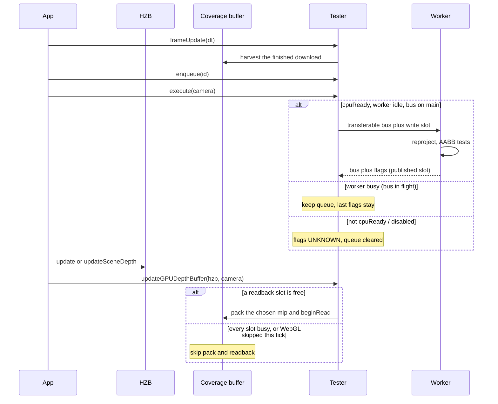

# Coverage buffer

Coverage reads one mip of an already-built hierarchical Z-buffer, packs it to a **view-space Z** map (metres, at most the default 256×128), downloads it, and tests AABBs on a Web Worker. Occluders are whatever the HZB already reduced. You get a CPU `getOcclusionStatus` on WebGL2 and WebGPU.

`OcclusionCullingSystem` does **not** create this path. Instantiate a buffer plus `CoverageBufferTesterWorker` yourself, and pass the same HZB you update.

Build the pyramid first (`hzb.update` or `hzb.updateSceneDepth`). Coverage does not read the depth grab. It picks the stored mip nearest to `maxWidth` × `maxHeight`, packs that mip so pixel `i` covers screen UV `[i / width, (i + 1) / width]`, takes the max device Z of the HZB texels under that slice, and linearizes that to view-space metres. The worker reprojects the last finished capture into the current camera, then tests queued AABBs against that map.

## Setup

Enable PlayCanvas depth grab on the camera, then pick the buffer that matches the device:

```ts
import {
    WebglHierarchicalZBuffer,
    WebgpuHierarchicalZBuffer,
    WebglCoverageBuffer,
    WebgpuCoverageBuffer,
    CoverageBufferTesterWorker,
    OCCLUSION_OCCLUDED,
} from "playcanvas-opti-pixel";

camera.camera.requestSceneDepthMap(true);

const hzb = device.isWebGPU
    ? new WebgpuHierarchicalZBuffer(device)
    : new WebglHierarchicalZBuffer(device);

const coverage = device.isWebGPU
    ? new WebgpuCoverageBuffer(device)
    : new WebglCoverageBuffer(device);

const tester = new CoverageBufferTesterWorker(coverage); // AABB capacity 4096

const id = tester.lock(meshAabb, worldMatrix);

app.on("frameupdate", (dt) => {
    tester.frameUpdate(dt);
});

app.on("update", () => {
    tester.enqueue(id);
    tester.execute(camera.camera);

    if (tester.getOcclusionStatus(id) !== OCCLUSION_OCCLUDED) {
        // draw — treat OCCLUSION_UNKNOWN as visible
    }
});

app.on("postrender", () => {
    hzb.update(camera.camera);
    tester.updateGPUDepthBuffer(hzb, camera.camera);
});
```

`CameraFrame` does not create a depth grab. Enable its scene depth and build the pyramid from that. `requestSceneDepthMap` is ignored while `framePasses` is set.

```ts
cameraFrame.rendering.sceneDepthMap = true;
cameraFrame.update();

app.on("postrender", () => {
    hzb.updateSceneDepth(camera.camera);
    tester.updateGPUDepthBuffer(hzb, camera.camera);
});
```

`rendering.sceneDepthMap` forces the linear prepass. TAA, DoF, volumetric fog, or SSAO combine can publish scene depth on their own (sometimes as `1 / viewZ`). `hzb.updateSceneDepth` decodes that into device Z; coverage linearizes the chosen mip back to view-space metres. Call both from `postrender` — in `update` the map is still the previous frame while the stored view-projection is this frame's.

`lock` / `unlock` / `enqueueAabbUpdate` live on the tester. Coverage owns a CPU AABB pool (`CoverageAABBStore`); it does not use the shared [`AABBStore`](../extras.md).

Call `tester.destroy()` and `coverage.destroy()` when done. `tester.resize(newCapacity)` grows the AABB pool. The HZB owns canvas resize. `coverage.resize(maxWidth, maxHeight)` changes only the packed map.

## Frame contract

The three calls are not interchangeable.

| Call | When | What it does |
| --- | --- | --- |
| `tester.frameUpdate(dt)` | Every frame, typically on `frameupdate`, **before** `enqueue` / `execute` | Copy the newest ready download into `coverage.cpuDepth` and drop the older ones |
| `tester.enqueue` then `execute(camera)` | `update`, after harvest | Copy the last capture (if `cpuVersion` changed), transfer a job bus to the worker, clear the queue |
| `hzb.update` or `hzb.updateSceneDepth`, then `tester.updateGPUDepthBuffer(hzb, camera)` | After opaque depth (`postrender`) | Build the pyramid, then pack its chosen mip to view-space Z and start an async readback on a free slot. The pack is skipped when every slot is busy, or on a WebGL tick that `readbackPeriod` skips. |


```mermaid
sequenceDiagram
    participant App
    participant HZB
    participant Buffer as Coverage buffer
    participant Tester
    participant Worker

    App->>Tester: frameUpdate(dt)
    Tester->>Buffer: harvest the finished download
    App->>Tester: enqueue(id)
    App->>Tester: execute(camera)
    alt cpuReady, worker idle, bus on main
        Tester->>Worker: transferable bus plus write slot
        Worker->>Worker: reproject, AABB tests
        Worker-->>Tester: bus plus flags (published slot)
    else worker busy (bus in flight)
        Note over Tester: keep queue, last flags stay
    else not cpuReady / disabled
        Note over Tester: flags UNKNOWN, queue cleared
    end
    App->>HZB: update or updateSceneDepth
    App->>Tester: updateGPUDepthBuffer(hzb, camera)
    alt a readback slot is free
        Tester->>Buffer: pack the chosen mip and beginRead
    else every slot busy, or WebGL skipped this tick
        Note over Buffer: skip pack and readback
    end
```

- Results belong to a **previous** completed job. The first frames return `OCCLUSION_UNKNOWN`.
- Treat `UNKNOWN` as visible. Only skip the draw on `OCCLUSION_OCCLUDED`.
- `enqueue` returns `-1` (`SOME_ENQUEUE_PROBLEM`) when the per-frame queue is already at AABB capacity.
- One in-flight worker job. If the bus is with the worker, `execute` returns without submitting; **enqueued ids are kept**. Do not enqueue the same id again while that queue is still held.
- After a completed job, ids that were **not** in that queue become `UNKNOWN` in the published flags.
- If the buffer is disabled or not `cpuReady`, `execute` fills `UNKNOWN` and **clears** the queue.
- `OcclusionCullingSystem` does not call coverage `frameUpdate`. You must.

`capture` without a pyramid texture is a no-op. Enable `requestSceneDepthMap(true)` (or CameraFrame scene depth) before `hzb.update` / `hzb.updateSceneDepth`, and call that before `updateGPUDepthBuffer`.

## Pack from an HZB mip

`maxWidth` × `maxHeight` (defaults 256×128) is the cap, not the map. Each axis picks the stored mip nearest to that cap; the coarser of the two is packed. The downloaded map is the screen footprint rounded to whole texels, and never larger than the cap. Pixel `i` covers screen UV `[i / cpuWidth, (i + 1) / cpuWidth]` and reads the HZB texel under the centre of that slice. A fractional footprint is rounded rather than ceiled, so the leftover does not become its own cell and shift the map. A slice wider than one and a half texels maxes every texel it overlaps. If that would still cover three or more source texels per packed pixel, the next coarser mip is used. WebGL HZB does not store levels finer than its `maxSize` (default 256), so those are not available to coverage. `uvFactor` is the HZB's own screen-to-mip scale, so padding outside the screen is not packed as full NDC.

`cpuWidth` × `cpuHeight` is the harvested footprint in texels. Until the first harvest, and after `resize` changes the packed pixel count, those report the cap. Pixel `i` covers `[i / cpuWidth, (i + 1) / cpuWidth]` (and the same on Y). Each packed texel is the device Z of the HZB texel under that cell (the max, when the cell covers more than one), then linearized to float view-space Z. Row 0 of the download is the bottom of the screen.

| Device | Pack | Download |
| --- | --- | --- |
| WebGL2 (`WebglCoverageBuffer`) | Transform feedback, `texelFetch` of the mip | Ring of `readbackSlots` `STREAM_READ` PBOs (default 5). `copyBufferSubData` + `fenceSync`. One `getBufferSubData` per `frameUpdate` |
| WebGPU (`WebgpuCoverageBuffer`) | Compute, `textureLoad` of the mip, into one storage buffer | Ring of `readbackSlots` persistent `MAP_READ` staging buffers (default 5). `copyBufferToBuffer`, then `mapAsync` after that frame submits |

Up to `readbackSlots` packed downloads stay in flight. A new pack starts whenever a slot is free, so call it from every `postrender` after the HZB update. A frame with no free slot does no GPU work.

`frameUpdate` publishes the **newest** eligible slot and retires the older ones unread. Coverage is not FIFO (HZB readback is): every capture replaces the whole depth map, so an older one is only staler. Draining FIFO would pin the latency at `readbackSlots` — once the ring filled, each tick would free exactly one slot and the next capture would refill it, so the oldest would never get younger.

Do not harvest from `capture` / `postrender`. `frameUpdate` is the poll.

The readback ring is allocated for `maxWidth` × `maxHeight` pixels. A window resize changes the HZB and therefore the footprint (`cpuWidth` / `cpuHeight` on the next harvest), not this ring, so in-flight captures and the last published one survive — coverage keeps culling while the window is being dragged. Changing `maxWidth` / `maxHeight` rebuilds the ring only when that pixel count changes, and the rebuild clears `cpuReady` until the next capture lands. A same-count change keeps the ring, in-flight captures, and the published map.

## Readback knobs

Shared by both buffers (defaults match WebGL HZB):

| Property | Default | Meaning |
| --- | --- | --- |
| `readbackSlots` | `5` | In-flight download slots, clamped to at least `2`. Extra slots absorb a GPU hitch without skipping captures; they do not add latency, since harvest takes the newest. Changing it drops downloads that have not landed. `cpuDepth` from the last finished slot stays. |
| `minReadbackLag` | `2` | `frameUpdate` ticks to wait before copying a finished slot into `cpuDepth`. Other slots can still capture during the wait. |

WebGL only:

| Property | Default | Meaning |
| --- | --- | --- |
| `readbackPeriod` | `1` | While a slot is free, submit a packed capture every N `updateGPUDepthBuffer` attempts. A busy ring does not advance the counter. Harvest still polls every `frameUpdate`. On Android Chrome, `getBufferSubData` is an ordered GPU-process wait — set this to `3` (or higher) there. |

WebGL constructor: `new WebglCoverageBuffer(device, maxWidth?, maxHeight?, minReadbackLag?)`.

WebGPU constructor: `new WebgpuCoverageBuffer(device, maxWidth?, maxHeight?)`. Lag and `readbackSlots` are still settable after construct. WebGPU has no `readbackPeriod`. Both skip the pack when every slot is busy.

Do not call `gl.flush()` or `clientWaitSync` after the PBO fence. Leave a slot's PBO or staging buffer alone until that slot has been read.

Typical readback latency is `minReadbackLag` frames (**2**) plus however long the fence or the map takes, then a worker job.

## Worker job

`CoverageBufferTesterWorker` owns:

- the AABB pool
- one transferable **job bus** (packed depth, AABBs, camera, queue)
- a two-slot ping-pong **output** ring (reprojected depth + flags)

`CoverageCpuBuffer` runs only inside the blob worker. Last flags stay in the published slot while the write slot is with the worker.

Each idle `execute` with `cpuReady`:

1. Flushes dirty AABBs into the bus (full copy after construct/resize, otherwise incremental `lock` / `enqueueAabbUpdate` ids).
2. Copies `coverage.cpuDepth` when `cpuVersion` changed, plus the capture view-projection and `camera_params`.
3. Writes the **current** view-projection, view matrix, camera position, `aabbExpand`, `rectPadPixels`, `depthBias`, and queue ids.
4. Transfers the bus and the write slot. The queue is cleared.

The worker reprojects capture depth into the current camera (perspective only; orthographic leaves the map at far):

1. Every capture sample is scattered into the current camera. When several land on one pixel, the nearest wins. Sky samples (within 5% of the capture far) and samples past the current far land as far, so they never occlude.
2. A pixel no sample landed on takes the **farthest** sample of its 3×3 neighbours. With no neighbour it stays at far.
3. `depthBias` moves every occluder away from the camera. Far stays far.

It then tests each queued AABB:

- Camera inside the (expanded) box → visible
- Box behind far, or fully in front of the nearest coverage sample → visible
- Box farther than every coverage sample → occluded
- Else: rasterize only the faces that look at the camera. Each face is two triangles. When every corner is in front of the near plane the corners are projected once; otherwise each triangle is clipped to the near plane. A box entirely in front of near is visible. A texel of a triangle occludes when its depth is nearer than the nearest eye Z of that triangle. The box is occluded only when every texel those faces actually cover is occluding. Empty corners of the screen AABB are not tested, so an oblique box is not kept visible by background beside its faces. A face that misses the map does not cull the box. `rectPadPixels` grows each triangle's bounds; texels in that pad use the same nearest eye Z

Moving occludees: `tester.enqueueAabbUpdate(id, aabb, matrix?)`. Prefer that over poking the internal store.

## Conservativeness

| Property | Default | Meaning |
| --- | --- | --- |
| `tester.aabbExpand` | `0` | World AABB inflate as a fraction of camera-to-box distance. Written into the bus each job. |
| `tester.rectPadPixels` | `0` | Extra coverage pixels around the projected rect. |
| `tester.depthBias` | `0` | Moves reprojected occluders away from the camera. `b > 0`: `z * (1 + b) + b`. `b < 0`: `z + abs(b)` metres. Written into the bus each job. |

The packed map is coarse. Thin occluders, foliage, and objects smaller than a texel tend to stay visible. Objects that write depth **after** the HZB update do not occlude this capture. Near-plane / first-person geometry in the pyramid can self-occlude; exclude it from the pyramid or from the test set.

Reprojection uses the last harvested capture, a few frames behind the camera. Each sample is the pixel centre, so motion toward a surface leaves one-pixel cracks. The 3×3 fill closes them with the farthest neighbour, so a crack at a silhouette takes the background, not the occluder. Wider gaps and the band at the screen edge the previous frame never saw stay at far. Raise `depthBias` when reprojected occluders hide objects just behind them.

## Debug overlay

`CoverageBufferDebugger` is a package export. Bind the tester so overlays can read packed CPU depth and the last reprojected map:

```ts
import { CoverageBufferDebugger } from "playcanvas-opti-pixel";

const debug = new CoverageBufferDebugger(app, tester);

app.on("update", () => {
    tester.enqueue(id);
    tester.execute(camera.camera);

    debug.drawDepth(0, 0, 0.35, 0.35);
    debug.drawReprojectedDepth(0.35, 0, 0.35, 0.35);
    debug.debugItem(id); // world AABB (green visible / red occluded) plus screen rect
});
```

- `drawDepth` — last harvested packed view-space Z (`coverage.cpuDepth`)
- `drawReprojectedDepth` — worker output (`tester.cpuViewer`)
- `debugItem(id, box?, rect?)` — uses `tester.getDebugInfo`
- `opacity` — overlay alpha from 0 to 1 (default `1`). Depth maps and the screen rect use it

`CoverageCpuBufferViewer` (`tester.cpuViewer`) can also query min/max view-space Z over a UV or pixel rectangle of that reprojected map. Origin is bottom-left, same as the packed CPU layout.

Call `debug.destroy()` with the tester.

## Limitations

- Coarser than GPU HZB; not a shadow map or triangle-perfect visibility
- Always delayed: about 2–5 frames of GPU readback, then one worker job
- One in-flight worker job; a slow test stalls new submits (queue is retained)
- Perspective cameras only for reprojection; ortho fills the map at far
- You must build the HZB, then drive `frameUpdate` and `updateGPUDepthBuffer(hzb, camera)` yourself

For same-frame GPU indirect draws, use [WebGPU HZB](hzb.md). For explicit CPU occluders and no GPU readback, use [software occlusion](software.md).
