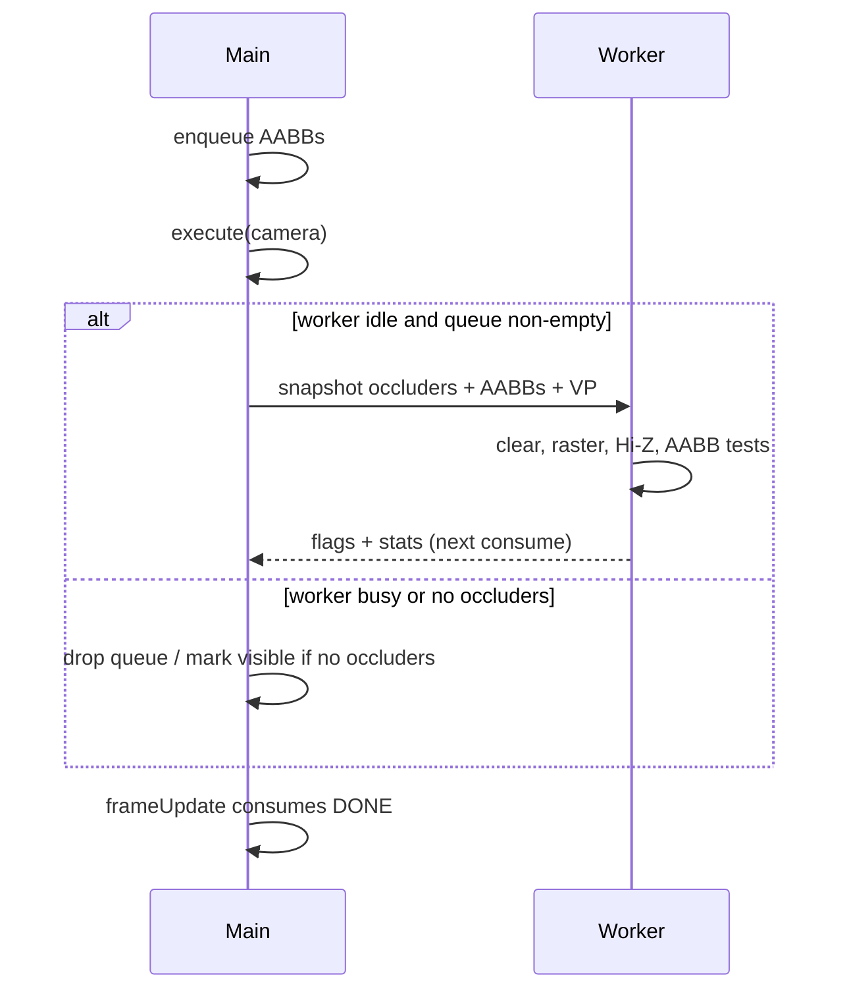

# CPU software occlusion

`SoftwareOcclusionTester` rasterizes **explicit occluders** on a Web Worker, builds Hi-Z only inside that worker, and tests queued AABBs. The main thread never owns the depth pyramid.

Works on WebGL2 and WebGPU. Requires you to register occluders; the framebuffer is not sampled.

## Setup

```ts
import {
    AABBStore,
    SoftwareOcclusionTester,
    OCCLUSION_OCCLUDED,
} from "playcanvas-opti-pixel";

const aabbs = new AABBStore(device, 4096);
const tester = new SoftwareOcclusionTester(aabbs, {
    width: 256,
    height: 128,
    occluderCapacity: 256,
});

const occludeeId = tester.lock(meshAabb, worldMatrix);

const occluderId = tester.occluders.lockBox(building.getWorldTransform());
// or: lockSphere, lockCylinder, lockCone, lockPlane
// or: lockMesh(meshInstance), lockMeshData(positions, indices, matrix)

app.on("update", (dt) => {
    tester.enqueue(occludeeId);
    tester.execute(camera.camera);
    tester.frameUpdate(dt);

    const visible = tester.getOcclusionStatus(occludeeId) !== OCCLUSION_OCCLUDED;
});
```

Call `destroy()` when done. Call `resize()` if the AABB store capacity grew in a way that needs a new shared buffer (the tester also recreates the worker when packed occluder data no longer fits).

## Frame contract



- `execute` copies view-projection, consumes a finished job, and **submits only if the worker is idle**.
- If the worker is still in `WORK`, the queue is cleared and this frame is skipped. Last flags stay. `enqueue` itself does **not** fail because the worker is busy.
- `enqueue` returns `-1` (`SOME_ENQUEUE_PROBLEM`) only when the per-frame queue is already at AABB-store capacity.
- If there are **zero occluders**, queued AABBs are marked visible immediately.
- `frameUpdate` only harvests `DONE` (same consume as the start of `execute`).

`ready` is false until the worker starts. `stats` holds timings in **milliseconds** from the last completed job (`rasterMs`, `hizBuildMs`, `aabbTestMs`, `workerMs`, counts, …).

## Occluder store

`tester.occluders` is an `OccluderStore`.

| Method | Geometry |
| --- | --- |
| `lockBox` / `lockSphere` / `lockCylinder` / `lockCone` / `lockPlane` | Unit primitive × matrix |
| `lockMesh(mesh \| meshInstance)` | Triangle snapshot; same `pc.Mesh` is interned |
| `lockMeshData(positions, indices?)` | Raw xyz; no indices ⇒ triangle soup |

Moving occluders: `enqueueUpdate(id, matrix)` — updates the matrix, bumps `version`.

`unlock(id)` releases the slot and mesh refcount.

Meshes are copied at lock time. If you morph the `pc.Mesh`, lock again.

Keep occluders **large and few**. Software raster at 256×128 will not represent foliage or thin rails well.

## SharedArrayBuffer

If `SharedArrayBuffer` is available (cross-origin isolated page: COOP/COEP), the tester uses a shared layout and atomics. Otherwise it `postMessage`s copies. Behaviour is the same; SAB avoids copies.

## Capacities

Defaults:

- Occluders: 256
- Packed mesh vertices: `65536 * 3` floats
- Packed mesh indices: `65536 * 6`

Raise `meshVertexCapacity` / `meshIndexCapacity` in the tester params if you lock large meshes. If packed data exceeds the current shared buffer, `execute` recreates the worker when idle.

## Limitations

- Conservative low-res raster: occludees smaller than a pixel may stay visible
- One in-flight job: high CPU raster time ⇒ dropped frames of tests
- Not a replacement for triangle-perfect visibility
